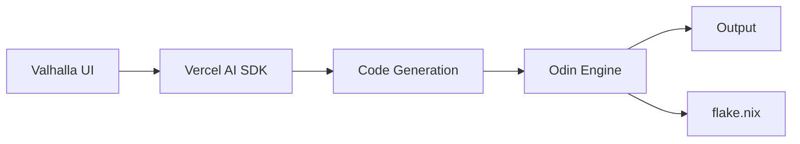

<div align="center">

# Valhalla

A next-generation code execution platform powered by Odin 

[](https://nextjs.org)
[](https://sdk.vercel.ai/)
[](https://nixos.org)

</div>

## ✨ Features

- 🤖 **AI-Powered Code Generation** - Intelligent code generation using Vercel's AI SDK + Open AI
- ⚡ **Real-Time Execution** - Instant code execution powered by [Odin](https://odin.evnix.cloud) engine
- 🔒 **Reproducible Environments** - Automatic `flake.nix` generation for perfect reproducibility
- 🎯 **Modern Interface** - Clean, responsive UI built with Next.js

## 🚀 Quick Start

### Prerequisites

- [Nix Package Manager](https://nixos.org/download.html) (recommended)
- [pnpm](https://pnpm.io/installation)
- Access to Odin execution engine (contact us for API key)

### Setup

1. Clone the repository:
```bash
git clone https://github.com/yourusername/valhalla.git
cd valhalla
```

2. Configure environment:
```bash
cp .env.example .env
```

3. Add your keys to `.env`:
```env
OPEN_API_KEY=your_api_key_here
# Add other required keys from .env.example
```

### Development

#### Using Nix (Recommended)
```bash
nix develop
pnpm install
pnpm dev
```

#### Without Nix
```bash
pnpm install
pnpm dev
```

Your development server will be running at [http://localhost:3000](http://localhost:3000) 🎉

## 🏗️ Architecture



## 🔧 Reproducible Environments

Every code execution automatically generates a `flake.nix` file that can be seen next to the output panel, enabling perfect reproducibility of your development environment. To use a generated flake:

```bash
nix develop 
```

## 🤝 Getting Help

Need the Odin execution engine API key? Contact us:
- 💬 Discord: [Join our community](https://discord.gg/9VMKq3rt5C)
- 🔧 Get odin server locally - [Odin](https://github.com/deepakdinesh1123/valkyrie)

<!-- ## 📜 License

MIT License - see [LICENSE](LICENSE) for details -->

---

<div align="center">
  
Built with ❤️ by the Valkyrie Team
<!-- 
[Documentation](docs) • [Contributing](CONTRIBUTING.md) • [Report Bug](issues) -->

</div>